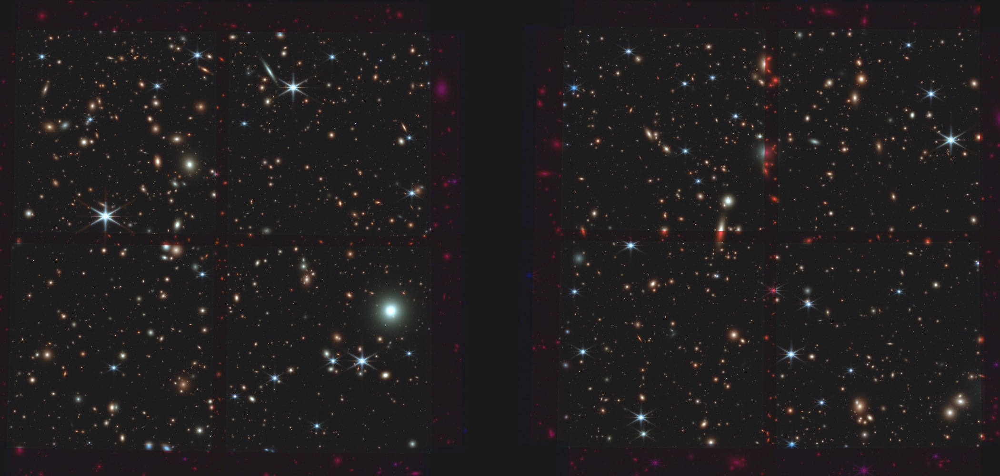
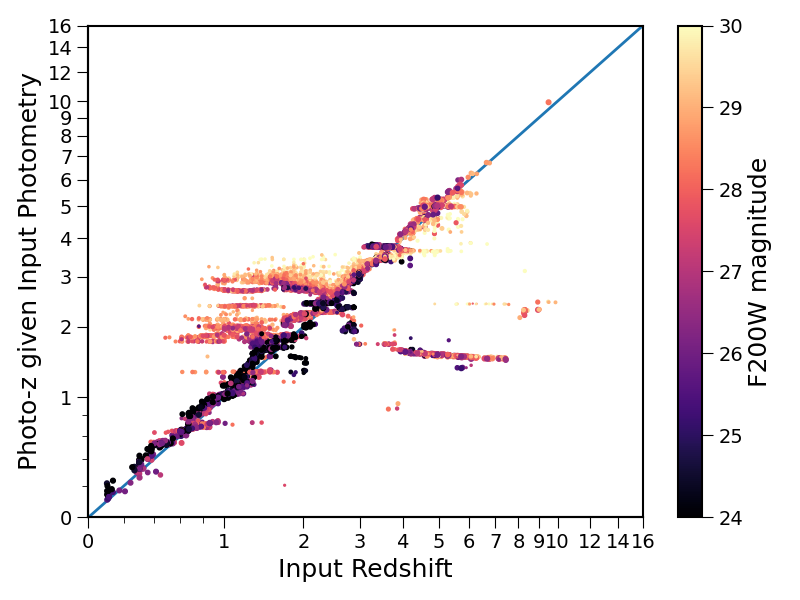

# Analyzing CEERS simulated NIRCam images

CEERS Simulated Data Release 3:  
https://ceers.github.io/releases.html#sdr3

NIRCam images in 6 filters: F115W F150W F200W F277W F356W F444W  
0.03" / pixel image reductions (native SW ~0.03", LW ~0.06")  

Catalogs and color images uploaded to Box:  
https://stsci.box.com/s/8wk3jmh3u1op7vnltkvfiro7k55d7t5a  

Notebooks here on Github:  
* Color images – (Trilogy)  
* NIRCam PSF-matched multiband photometry – (Astropy Photutils)  
* Photometric redshifts and physical parameters – (EAZY)
* Catalog explorer (input vs. output colors & photo-z's; SED plots; SNR vs. mag; show galaxy in all filters)

To do list:  
☐ Distinguish stars (brown dwarfs) from galaxies (as in LePhare)  
☐ Remove stellar diffraction spike detections (machine learning?)  
☐ Optimize catalog to ensure we detect the faintest objects  
☐ Add HST photometry to SED fitting    
☐ Upload BAGPIPES notebook  

